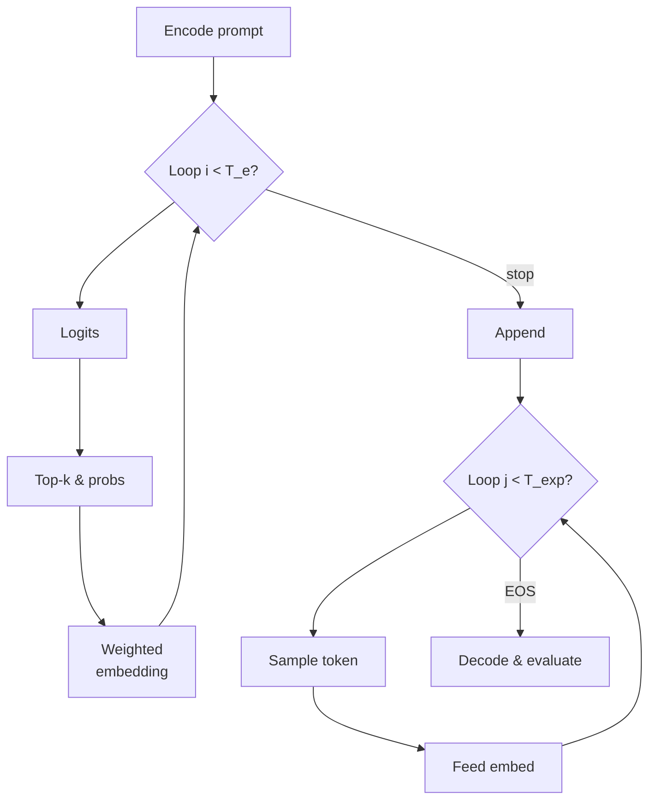

# Simple Mixture-of-Embeddings Generation on GSM8K

This repository contains **`simple.py`**, a self-contained research script that benchmarks a *mixture-of-token-embeddings* decoding strategy on the GSM8K arithmetic-reasoning dataset.

> **TL;DR**  
> Phase-1 mixes the *embeddings* of the top-k probable tokens to let the model "think" in continuous space, then Phase-2 switches back to ordinary token-by-token generation to produce the final answer, boxed `\boxed{}`.

---

## 1. Quick Start

```bash
# (1) Create an environment
conda create -n mix2 python=3.10 -y
conda activate mix2
pip install -r requirements.txt

# (2) Run the experiment with default params (≈50 GSM8K problems)
python simple.py \
  --T_e 200   # embedding-mixture steps
  --k 5       # top-k for mixture
  --T_total 600  # total generation steps (T_e + T_exp)
  --num_examples 50 \
  --temperature 0.6
```

(3) Running using slurm
```bash
sbatch run_gsm8k_experiments.slurm
```

Output includes running accuracy, token-budget statistics and a JSON/PKL dump under `generation_comparison/`.


(3) Printing the results
```bash
python print_generation.py --dir generation_comparison/non_uniform/600_200_0.6/
```
---

## 2. Method Overview

1. **Prompt Building** – A chat template instructs the model to think step-by-step and box the final answer.
2. **Phase 1 – Continuous Thinking** (`T_e` steps)
   * Compute logits for the last token.
   * Pick the top-k ids and their probabilities.
   * Form a *probability-weighted average* of their embeddings and feed it back—instead of a discrete token.
   * Early-stop if the probability of the sequence terminator (`'</'`) exceeds `min_end_prob`.
3. **Transition Tokens** – Append `</think><think>` to delimit reasoning vs. answering.
4. **Phase 2 – Standard Generation** (`T_exp = T_total - T_e` steps)
   * Revert to ordinary sampling (`temperature`, `top-p`) one token at a time until ⟨eos⟩.
5. **Post-processing** – Extract the numeric answer with regexes and compare to GSM8K ground truth.

### Mermaid Diagram


---

## 3. File Tour

* `simple.py` – all logic: data loading, custom decoding, evaluation, and result dumping.
* `generation_comparison/` – auto-created; contains JSON & pickle logs per run.
* `requirements.txt` – install list (see below).

---

## 4. Key Hyper-parameters

| Flag           | Meaning                                        | Default |
|----------------|------------------------------------------------|---------|
| `--T_e`        | Phase-1 mixture iterations                     | `200`   |
| `--k`          | Top-k tokens mixed each step                   | `5`     |
| `--T_total`    | Total decoding budget (Phase-1 + Phase-2)      | `600`   |
| `--temperature`| Sampling temperature for both phases           | `0.6`   |
| `--num_examples`| # GSM8K test problems to evaluate              | `50`    |

---

## 5. Requirements

```
transformers>=4.39
datasets>=2.17
torch>=2.1
numpy, tqdm, click, mermaid-cli (optional for local diagram preview)
```
A ready-made `requirements.txt` is provided.

---

## 6. Notes & Limitations

* Tested with **Qwen/Qwen2.5-3B-Instruct**; any causal-LM with `get_input_embeddings` should work.
* The mixture trick is experimental and not optimised for speed (runs on GPU-16 bit but still ≈3-4× slower).
* Accuracy metric is *strict* numeric match after float parsing (absolute tol 1e-6).

---

## 7. Citation
If you use this code, please cite the repo and the Qwen-2.5 model. 